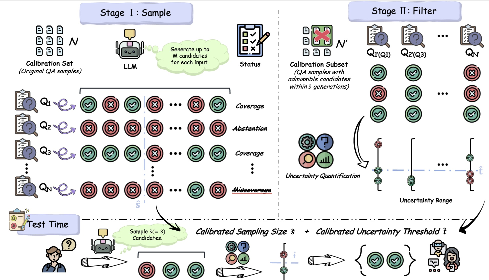

# SAFER: Risk-Constrained Sample-Then-Filter in Large Language Models (ICLR2026)

Official implementation of **SAFER** (SAmpling and conformalized FiltERing), a two-stage risk control framework for trustworthy question answering with Large Language Models (LLMs).

You can find paper here: [arXiv:2510.10193](https://arxiv.org/abs/2510.10193)
## Overview

As LLMs are increasingly deployed in risk-sensitive applications such as real-world open-ended question answering (QA), ensuring the trustworthiness of their outputs has become critical. SAFER addresses the limitations of existing selective conformal prediction (SCP) methods by introducing a two-stage framework:

1. **Stage 1: Abstention-aware Sampling** - Calibrates a sampling budget within the maximum sampling cap using the Clopper-Pearson exact method at a user-desired risk level (α). If the risk level cannot be satisfied, the system abstains.

2. **Stage 2: Conformalized Filtering** - Applies conformal risk control to determine a statistically valid uncertainty threshold (β), which filters unreliable distractors from the candidate set while controlling the risk of excluding correct answers.


## Repository Structure

```
SAFER/
├── parse_dataset/          # Dataset parsing and preprocessing
│   ├── parse_sciqa.py     # SciQA dataset parser with few-shot prompting
│   ├── parse_triviaqa.py  # TriviaQA dataset parser
│   └── parse_coqa.py      # CoQA dataset parser
├── code/                   # Main experimental pipeline
│   ├── generate.py        # Multi-sample generation from LLMs
│   ├── clean_open_domain_qa.py              # Text cleaning and preprocessing
│   ├── open_domain_qa_similarity.py         # Semantic similarity scoring
│   ├── open_domain_qa_entailment.py         # Bi-directional entailment scoring
│   ├── open_domain_qa_rouge.py              # ROUGE-L metric computation
│   ├── open_domain_qa_llm_eval.py           # LLM-based evaluation
│   ├── get_open_domain_qa_logits.py         # Token-wise entropy computation
│   ├── open_domain_risk_control_first.py    # Stage 1: Sampling budget calibration
│   ├── open_domain_risk_control_second.py   # Stage 2: Uncertainty filtering
│   ├── first_stage_without_abstention.py    # Baseline without abstention
│   ├── clopper_pearson_upper_bound.py       # Statistical bound validation
│   └── filtering_efficiency.py              # Efficiency analysis
├── llm/                    # LLM wrapper classes
│   └── Qwen.py            # Qwen model interface with chat templates
├── utils/                  # Evaluation utilities
│   └── eval_utils.py      # AUARC and accuracy metrics
└── cache_metrics/          # Metric implementations
    └── rouge.py           # ROUGE metric wrapper
```

## Installation

### Requirements

- Python 3.8+
- PyTorch 2.0+
- CUDA 11.8+ (for GPU acceleration)


### Dataset Preparation

Download the required datasets from HuggingFace:

```bash
# Expected directory structure:
../row_data/
├── sciqa/validation-00000-of-00001.parquet
├── triviaqa/validation-00000-of-00001.parquet
└── coqa/validation-00000-of-00001.parquet
```

### Model Cache Setup

Download pre-trained models locally (recommended for reproducibility):

```bash
# Set your model cache directory
export MODEL_CACHE=/path/to/your/model/cache

# Download models (example using huggingface-cli)
huggingface-cli download Qwen/Qwen2.5-7B-Instruct --local-dir $MODEL_CACHE/Qwen2.5-7B-Instruct
huggingface-cli download meta-llama/Llama-3.1-8B-Instruct --local-dir $MODEL_CACHE/Llama-3.1-8B-Instruct
```

## Quick Start

### Step 1: Parse Datasets

```bash
cd parse_dataset

# Parse SciQA dataset
python parse_sciqa.py \
    --cache-model /path/to/model/cache \
    --generate-model Qwen2.5-7B-Instruct

# Parse TriviaQA dataset
python parse_triviaqa.py \
    --cache-model /path/to/model/cache \
    --generate-model Qwen2.5-7B-Instruct

# Parse CoQA dataset
python parse_coqa.py \
    --cache-model /path/to/model/cache \
    --generate-model Qwen2.5-7B-Instruct
```

### Step 2: Generate Candidate Answers

```bash
cd code

# Generate multiple diverse answers per question
python generate.py \
    --dataset sciqa \
    --generate-model Qwen2.5-7B-Instruct \
    --cache-model /path/to/model/cache \
    --num-generations-per-prompt 20 \
    --temperature 1.0 \
    --top-p 0.9 \
    --max-length-of-generation 128
```

### Step 3: Clean Generated Texts

```bash
python clean_open_domain_qa.py \
    --dataset sciqa \
    --generate-model Qwen2.5-7B-Instruct
```

### Step 4: Compute Admission Scores

SAFER supports multiple admission criteria. Choose one or more:

```bash
# Semantic similarity (using CrossEncoder)
python open_domain_qa_similarity.py \
    --dataset sciqa \
    --generate-model Qwen2.5-7B-Instruct

# Bi-directional entailment (using DeBERTa)
python open_domain_qa_entailment.py \
    --dataset sciqa \
    --generate-model Qwen2.5-7B-Instruct

# ROUGE-L lexical overlap
python open_domain_qa_rouge.py \
    --dataset sciqa \
    --generate-model Qwen2.5-7B-Instruct

# LLM-based evaluation
python open_domain_qa_llm_eval.py \
    --dataset sciqa \
    --generate-model Qwen2.5-7B-Instruct \
    --cache-model /path/to/model/cache
```

### Step 5: Compute Uncertainty Scores

```bash
# Token-wise entropy computation
python get_open_domain_qa_logits.py \
    --dataset sciqa \
    --generate-model Qwen2.5-7B-Instruct \
    --cache-model /path/to/model/cache
```

### Step 6: Apply SAFER Risk Control

#### Stage 1: Sampling Budget Calibration with Abstention

```bash
python open_domain_risk_control_first.py \
    --dataset sciqa \
    --generate-model Qwen2.5-7B-Instruct \
    --alpha 0.1 \
    --delta 0.05 \
    --split-ratio 0.5 \
    --relevance-threshold 0.6 \
    --admission-criteria similarity
```

**Parameters:**
- `--alpha`: Risk level for Stage 1 (maximum miscoverage rate for sampling sets)
- `--delta`: Significance level for Clopper-Pearson bounds
- `--split-ratio`: Fraction of data for calibration (rest for testing)
- `--relevance-threshold`: Threshold for determining correct answers
- `--admission-criteria`: Scoring method (similarity/entailment/rouge/llm_eval)

#### Stage 2: Conformalized Filtering

```bash
python open_domain_risk_control_second.py \
    --dataset sciqa \
    --generate-model Qwen2.5-7B-Instruct \
    --alpha 0.1 \
    --beta 0.1 \
    --delta 0.05 \
    --split-ratio 0.5 \
    --relevance-threshold 0.6 \
    --admission-criteria similarity
```

**Additional Parameter:**
- `--beta`: Risk level for Stage 2 (maximum miscoverage rate for filtered sets)

### Step 7: Evaluate Results

```bash
# Validate statistical bounds
python clopper_pearson_upper_bound.py \
    --dataset sciqa \
    --generate-model Qwen2.5-7B-Instruct \
    --alpha 0.1 \
    --split-ratio 0.5

# Analyze filtering efficiency
python filtering_efficiency.py \
    --dataset sciqa \
    --generate-model Qwen2.5-7B-Instruct \
    --alpha 0.1 \
    --beta 0.1 \
    --split-ratio 0.5
```


## Supported Datasets

- **SciQA**: Science questions with expert-written answers
- **TriviaQA**: Trivia questions with multiple evidence documents
- **CoQA**: Conversational question answering with context


## Experimental Parameters

### Default Configuration

```python
# Generation
num_generations_per_prompt: 20
temperature: 1.0
top_p: 0.9
max_length_of_generation: 128

# Risk Control
alpha: 0.1                    # Stage 1 risk level
beta: 0.1                     # Stage 2 risk level
delta: 0.05                   # Significance level
split_ratio: 0.5              # Calibration/test split

# Admission Criteria
relevance_threshold: 0.6      # Threshold for correctness
admission_criteria: similarity # similarity/entailment/rouge/llm_eval

# Reproducibility
seed: 10
```

## Output Format

Results are saved in `../records/{dataset}/{model}/{params}/`:

```
generations.pkl              # Raw generations from LLM
cleaned_generations.pkl      # Cleaned and preprocessed texts
similarity_scores.pkl        # Semantic similarity scores
entailment_scores.pkl        # Entailment scores
rougel_scores.pkl           # ROUGE-L scores
llm_scores.pkl              # LLM evaluation scores
entropies.pkl               # Token-wise entropy values
generations.json            # Human-readable generation results
```

## Citation

If you use this code in your research, please cite:

```bibtex
@article{wang2025safer,
  title={SAFER: Risk-Constrained Sample-then-Filter in Large Language Models},
  author={Wang, Qingni and Fan, Yue and Wang, Xin Eric},
  journal={arXiv preprint arXiv:2510.10193},
  year={2025}
}
```


## Contact

For questions or issues, please open an issue on GitHub or contact [qingni1031@gmail.com].

## Acknowledgments

This work builds upon research in conformal prediction, selective prediction, and uncertainty quantification for large language models. We thank the open-source community for the excellent tools and models that made this work possible.
